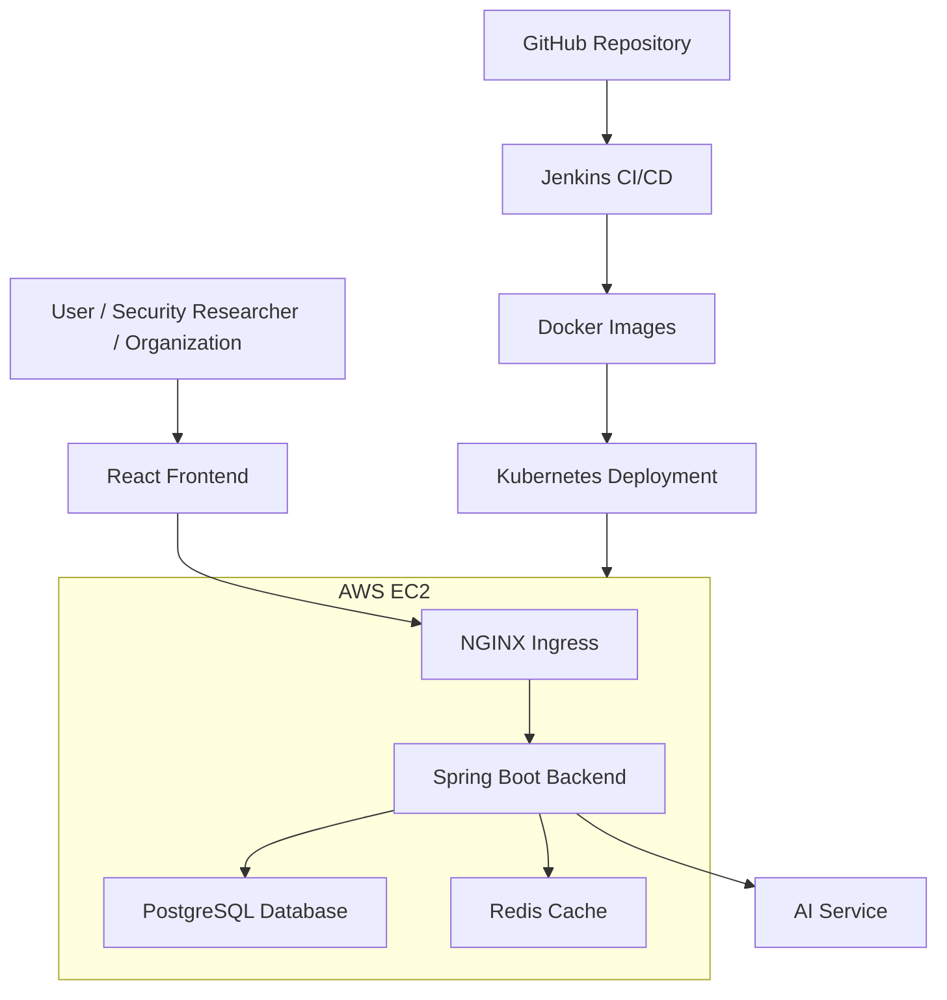

## Project Overview

Recon0 is a web-based Bug Bounty and Vulnerability Disclosure Platform designed to facilitate responsible security vulnerability reporting between security researchers and organizations. The platform provides a secure and streamlined workflow for reporting, reviewing, and managing vulnerabilities throughout their lifecycle.

Security researchers can submit detailed vulnerability reports, while organizations can evaluate submissions, communicate with researchers, update report statuses, and efficiently manage security issues through a centralized dashboard.

The application is built with a React frontend and a Spring Boot backend, providing secure authentication, role-based access control (RBAC), and RESTful APIs to ensure a reliable and scalable user experience.

## Features

### 🔐 Authentication & Authorization

* Secure user authentication using JWT.
* Role-Based Access Control (RBAC) for different user roles.
* Protected APIs and role-specific access to platform features.

### 🐛 Vulnerability Reporting

* Submit detailed vulnerability reports to organizations.
* Track the status and lifecycle of submitted reports.
* Manage and review vulnerability submissions.
* Support communication between researchers and organizations.

### 🤖 AI-Enhanced Reporting

* AI-assisted vulnerability report enhancement.
* Helps bounty hunters improve the quality and structure of their reports.
* Assists researchers in presenting vulnerability findings more clearly.

### 🏆 Gamification

* XP-based progression system.
* Global leaderboard for ranking researchers.
* Achievement badges for milestones and accomplishments.
* Encourages continuous participation and responsible vulnerability research.

### 📚 Learning Dashboard

* Dedicated dashboard for cybersecurity learning.
* Access to educational resources and learning content.
* Helps researchers improve their vulnerability research and security knowledge.

### 📊 Dashboards

* Researcher dashboard for managing reports, XP, achievements, and learning activities.
* Organization dashboard for reviewing and managing vulnerability reports.
* Centralized view of relevant platform activities and statistics.

### 📖 API Documentation

* RESTful APIs built using Spring Boot.
* Interactive API documentation using Swagger/OpenAPI.

### 🚀 Deployment & DevOps

* Dockerized application for consistent deployment.
* Kubernetes-based application deployment.
* Automated CI/CD pipeline using Jenkins.
* Hosted on AWS EC2.

## Tech Stack

### Frontend

* React
* HTML5
* CSS3
* JavaScript
* Bootstrap
* Axios

### Backend

* Java
* Spring Boot
* Spring Security
* Spring Data JPA
* Hibernate
* REST APIs

### Database & Caching

* PostgreSQL
* Redis

### AI

* AI integration for vulnerability report enhancement

### DevOps & Deployment

* Docker
* Kubernetes
* Jenkins
* AWS EC2
* NGINX Ingress

### Development & Documentation

* Git
* GitHub
* Maven
* Swagger / OpenAPI

## Architecture

Recon0 follows a client-server architecture with a React-based frontend and Spring Boot backend. The application is containerized using Docker and deployed using Kubernetes on AWS EC2.



## Architecture

Recon0 follows a client-server architecture with a React-based frontend and Spring Boot backend. The application is containerized using Docker and deployed using Kubernetes on AWS EC2.

flowchart TD

    User[Users]

    subgraph AWS[AWS EC2]
        Ingress[NGINX Ingress]

        subgraph Kubernetes[Kubernetes Cluster]
            Frontend[React Frontend]
            Backend[Spring Boot Backend]
            Redis[(Redis)]
        end
    end

    PostgreSQL[(PostgreSQL)]
    AI[AI Service]

    User --> Ingress
    Ingress --> Frontend
    Ingress --> Backend

    Backend --> PostgreSQL
    Backend --> Redis
    Backend --> AI

    GitHub[GitHub] --> Jenkins[Jenkins CI/CD]
    Jenkins --> Docker[Docker Image]
    Docker --> Kubernetes

### Architecture Components

* **React Frontend** – Provides the user interface for researchers and organizations.
* **NGINX Ingress** – Handles incoming HTTP/HTTPS traffic and routes requests to the appropriate application service.
* **Spring Boot Backend** – Handles business logic, authentication, authorization, vulnerability management, gamification, learning features, and REST APIs.
* **PostgreSQL** – Stores application data such as users, vulnerability reports, organizations, XP, badges, and other platform information.
* **Redis** – Used for caching and improving application performance.
* **AI Service** – Supports the AI-enhanced vulnerability report feature.
* **Docker** – Containerizes the application components.
* **Kubernetes** – Manages application containers and deployments.
* **Jenkins** – Automates the CI/CD pipeline from source code to deployment.
* **AWS EC2** – Hosts the Kubernetes-based application deployment.

## Project Structure

```text
Recon0/
│
├── Recon0 Frontend/
│   └── React application
│
├── Recon0 Backend/
│   └── Spring Boot application
│
├── kubernetes/
│   └── Kubernetes manifests
│
├── Jenkinsfile
└── README.md

## My Contributions

My primary role in the project was focused on backend development and DevOps.

### Backend Development

- Designed and developed the backend using Spring Boot.
- Developed RESTful APIs for the core platform functionality.
- Implemented authentication and authorization using Spring Security and JWT.
- Implemented Role-Based Access Control (RBAC).
- Integrated PostgreSQL using Spring Data JPA and Hibernate.
- Implemented business logic for vulnerability reporting and report management.
- Developed backend functionality for gamification features such as XP, badges, and leaderboards.
- Integrated the AI-enhanced vulnerability report functionality.
- Developed APIs to support the learning dashboard and related features.
- Documented REST APIs using Swagger/OpenAPI.

### DevOps & Deployment

- Containerized application components using Docker.
- Created and configured Kubernetes deployment resources.
- Configured Kubernetes services and ingress for application routing.
- Developed the Jenkins CI/CD pipeline for automated application deployment.
- Automated Docker image building and deployment through Jenkins.
- Deployed the application on AWS EC2 using Kubernetes.
- Managed the deployment workflow from source code to running application.


